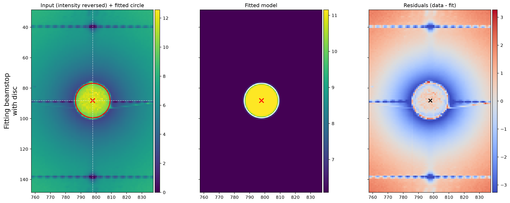
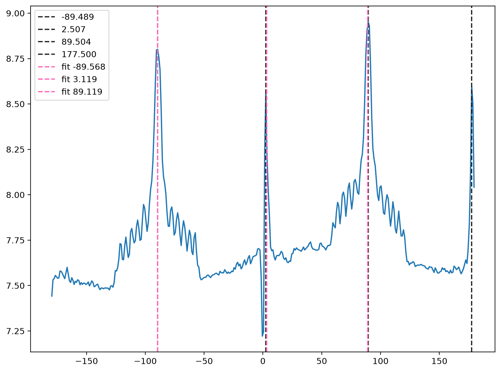
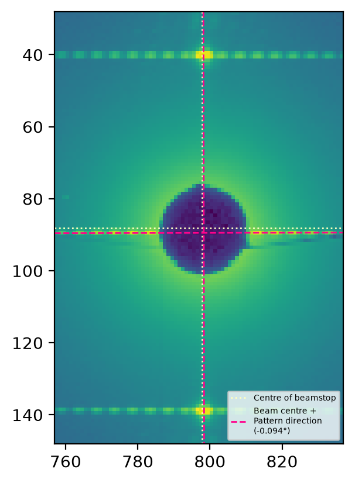
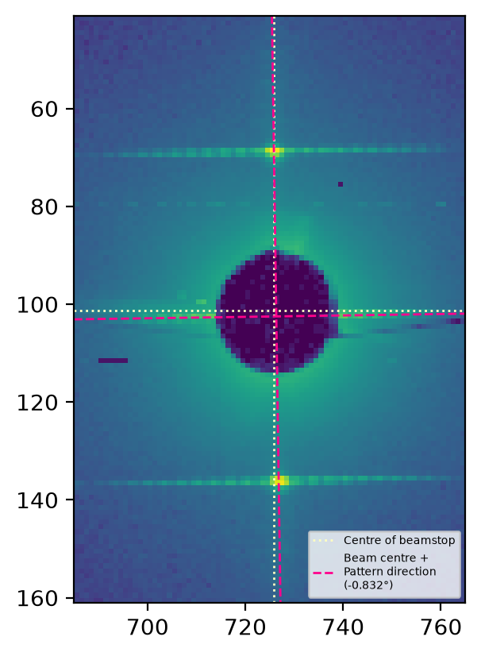
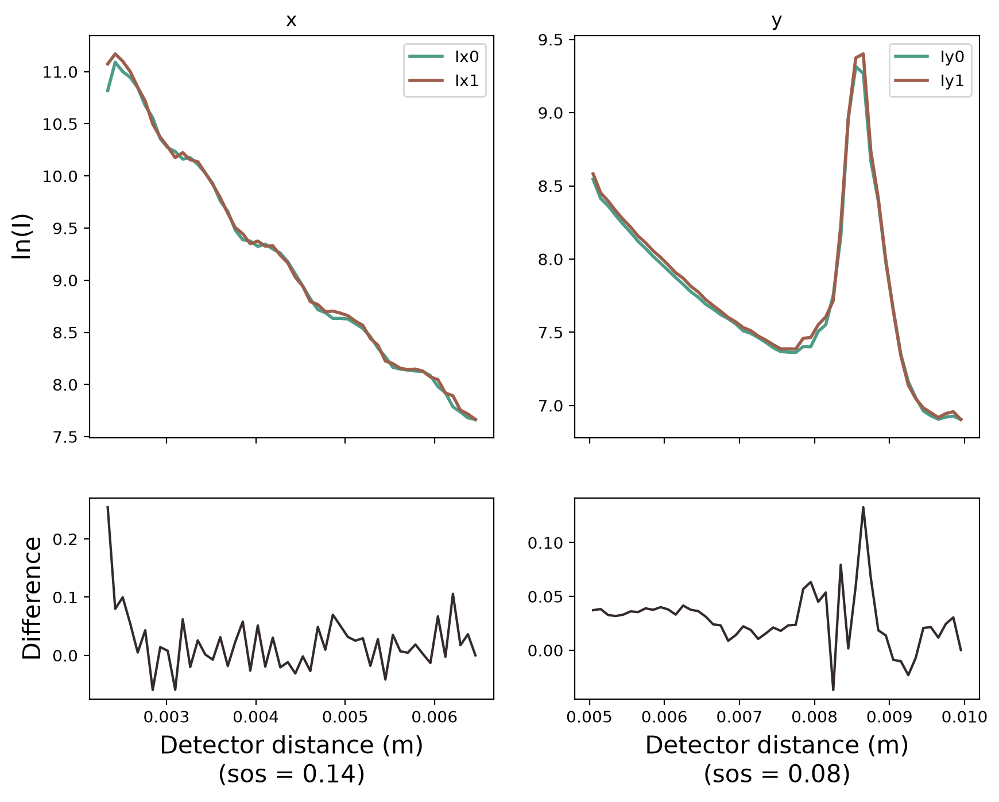
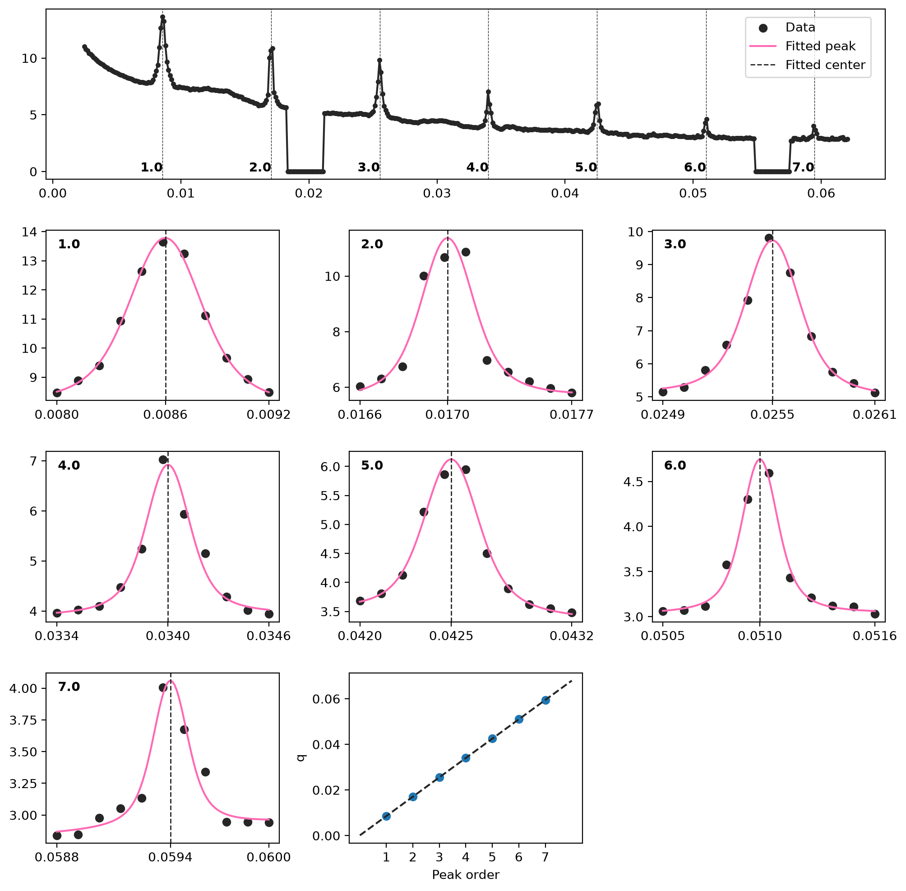

# I22 Diffraction Grating Calibration

This small tool should generate a calibration file for use with diffraction grating experiments.

This page is intended as a *practical* demonstration & explanation of its use, rather than a comprehensive documentation.

## Usage

Once installed, the tool can be used simply with just the input file:

``` bash 
$ i22-diffraction-grating-calibration --file input_file.nxs 
Starting calibration. Locating beamstop & beam center
Pattern rotation approx. ANGLE degrees
Calibrating detector distance
Detector located at DISTANCE m. 
Writing calibration file to: output_folder/SAXS_calibration.nxs
```

When running, a short log is written to the terminal, detailing the angle of the diffraction pattern, the distance the detector is found at, and where the output files have been saved. 

Additional options can be used by the CLI in case the program hasn't successfully calibrated. It should be possible to use these in combination with the figures generated by the naive routine to correct the program behaviour.

## CLI reference

This is a reproduction of the help menu of the program:

``` bash
$ i22-diffraction-grating-calibration --help
usage: i22-diffraction-grating-calibration [-h] [-v] [--file INPUT] [--grating-spacing GRATING_SPACING] [--x-offset X_OFFSET] [--y-offset Y_OFFSET]
                                           [--peak-prominance PEAK_PROMINANCE] [--output-path OUTPUT_PATH] [--outname OUTNAME] [--save-plots]

Calibration for a diffraction grating

options:
  -h, --help            show this help message and exit
  -v, --version         show program's version number and exit
  --file INPUT          Path to input nexus file
  --grating-spacing GRATING_SPACING
                        Spacing of diffraction grating in nm. Default 100.
  --x-offset X_OFFSET   Space (in pixels) to use around estimated beamstop and beam position. Default=40
  --y-offset Y_OFFSET   Space (in pixels) to use around estimated beamstop and beam position. Default=60
  --peak-prominance PEAK_PROMINANCE
                        Peak prominance to use in scipy.signal.find_peaks when finding grating fringes. Default=0.1
  --output-path OUTPUT_PATH
                        Path to where calibration file will be written
  --outname OUTNAME     Name of output calibration file. Defaults to 'SAXS_calibration'
  --no-plots            Don't save processing plots alongside the calibration file
  ```

The only required option is `--file`, the name of the nexus file where a calibration image has been recorded. The other options are as follows:

- `--grating-spacing`
    * The spacing of the diffraction grating in nm. By default this is 100 (nm)
- `--x-offset`/`--y-offset`
    * When finding the beamstop and fitting the location of the beam center, the program selects a region around where it expects this to be to speed up optimisation. The `--x/y-offset` options can be used to narrow/widen this window as required, in case the fringes lie outside the default region. See the image below for further explanation of this problem. 
- `--peak-prominance`
    * Once the beam center is determined and an azimuthal integration is performed, peaks are found using the standard SciPy routine. Should too many/few peaks be found by the routine, this argument may be useful to fine tune the initial identification before fitting and indexing.
- `--output-path`, `--outname`
    * These options control the name and destination of output files. By default, all the files generated by this program are written to a subfolder, `calibration/` of the directory. This include the calibration file, which will usually be called `SAXS_calibration.nxs`. These folder and file names can be changed using the two arguments here respectively. Note that for convenience the `--outname` argument only requires the file name, not the `.nxs` suffix.
- `--no-plots`
    * By default, the program will generate and save a number of plots to show how the calibration has been acheieved. If the `--no-plots` flag is used, then only the calibration `.nxs` file will be saved, without any plots.

## Method

The program uses the following method to generate a calibration file once data is loaded successfully:

### 1) Fit the beamstop.

We first identify where the beamstop is by locating the bright halo around it, then fitting a disc shape to the 2d image. The fit is saved as `beamstop_fit.png` (see below).

### 2) Determine the angle of the diffraction pattern

Using the beamstop center as a proxy for the beam center, we do a quick radial integration from this location to check the extent to which the grating is offset from perfectly horizontal/vertical axes. This generates an image, `beam_direction.png`, which shows intensity integrated around azimuthal angles.

The routine finds distinct peaks in this data, the most prominant of which will have resulted from the long spacing of the grating. These are fitted, and the centers found by the fits plotted in the image. We then use the centers to calculate the angular offset of the pattern. 

### 3) Fit the center of the beam

Using the center of the beamstop and the angular offset as starting points, we determine the position of the beam center itself. This is the longest step of the program, as it necessitates iterative integration of the beam profiles in both x/y detector directions.

The routine works by:

1) Picking an x or y direction along the detector. The direction not picked is kept frozen for the purposes of the routine.
2) Integrating a thin azimuthal slice around both the positive and negative directions of the angular offset found in the main step above.
3) Comparing the two profiles, and calculating the sum of squared differences (SOS) between them.
4) Minimising the SOS over an optimisation routine.
5) Once one direction is optimised, freeze this direction and repeat steps 2-4 for the other direction.

Once both directions are complete, two images are generated. `beam_profiles_xy.png` shows the result of the comparative optimisation routine, i.e. how well the profiles have been matched in both the x and y directions. The `beam_center_location.png` figure shows the results of all the steps so far: where the beamstop was located, where the center of the beam is, and which angle the grating is in.

### 4) Calibrate the detector distance

With the direction of the most intense profile determined, the calibration can be performed. A sufficiently narrow azimuthal integration is performed in direction of the grating peaks. Peaks are then found from the signal & fitted using a combination of a Voigt peak with a linear background.

Using the set of fitted peaks, an indexing is generated to assign each peak to it appropriate Bragg index. NOTE: This is a challenging operation, and although implmented robustly and conservatively, may not result in correct indexing.

Using the indexing assigned, the scattering vector at which the peaks are found is fitted to determine the detector distance.

The above routine is then shown in a single plot, `detector_calibration.png`, showing 1) the integrated signal, and where the peaks are found, 2) details of each peak fit, and 3) the fitting of the indexing routine.

### 5) Calibration file

Using the calculated detector distance, a calibration file is written that can be used for further processing. The file, and all of the plots generated can be found in the output directory specified.

## Figures 

The program generates a number of figures and files to demonstrate its success (or failure). 

### `beamstop_fit.png`

This compound figure shows (L-R) the location of the fitted circle at the boundary of the beamstop (the intensity of this image is reversed), the fitted disc model used in totality (useful if the edge of the beamstop is diffuse for some reason), and the residual of the fit.




### `beam_direction.png`

This figure shows the radial integration profile. The radial profile is generated using a generous radial range, which should generate a signal with prominant peaks in the 4 directions of the diffraction pattern.

The figure also shows where the initial peaks have been found in the signal, and the location of their centers after fitting. Note that because of the signal discontinuity, peaks near +/- 180 are not fitted.



### `beam_center_location.png`

These two images show the result of processing stage 3 above for two difference files. The pattern in the left image is almost perfectly horiztonal/vertical, while the one on the right is not. 

Note for the angled image how the straight lines for the beamstop centre are distinctly offset from the angled lines which have identified the pattern. The angled lines go through the centre of the bright peaks.

<p float="left">
  
   
</p>

### `beam_profiles_xy.png`

This compound figure shows how well the integrated profiles in the two directions have been fitted. The profiles themselves are plotted in the top frames. Ideally these should overlap as much as possible, indicating that the centre of the beam has been perfectly found.

The lower row shows the arithmetic difference between the two profiles.

The axis label is at this point indicated in physical distance rather than scattering vector, because no calibration has yet taken place. The "SOS" label in the figure indicates the final sum-of-squares difference achieved by the optimisation routine in aligning the profiles.





### `detector_calibration.png`

The compound figure highlights how the final distance calibration has been achieved. 

The top row of the figure shows the integrated profile along the grating spacing, showing the data, where the peaks have been found, and how they have been indexed. 

Most of the subplots in the figure show how the individual peaks have been fitted, showing the data.

The final plot shows what should be a perfectly linear fit to the indexed peak position and the scattering vectors they have been found at, as used to determine the detector distance.


